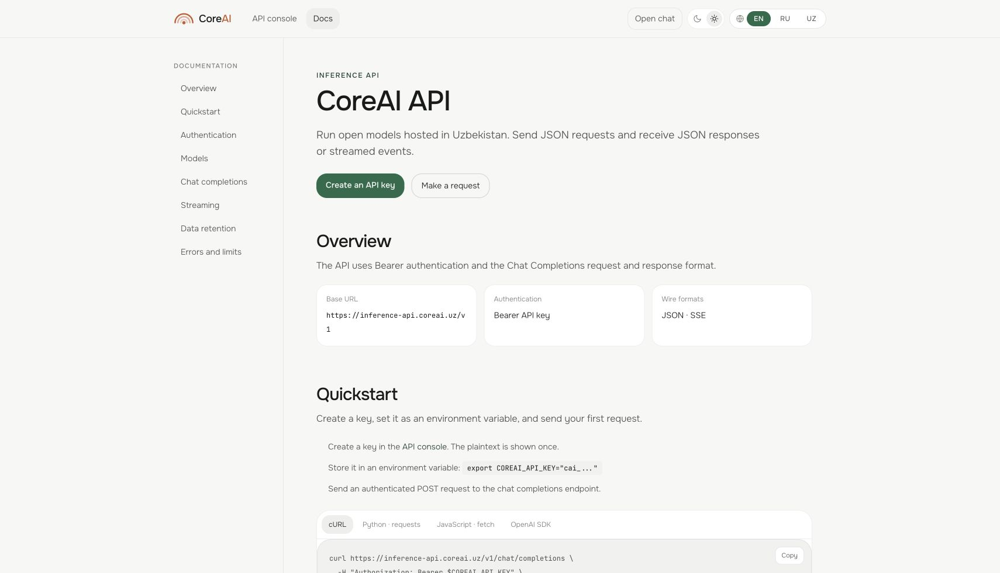
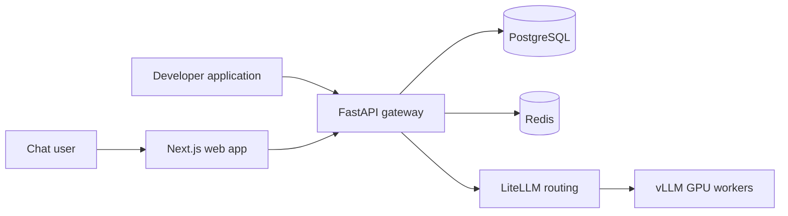

<p align="center">
  <picture>
    <source media="(prefers-color-scheme: dark)" srcset="frontend/public/coreai-logo-white.svg">
    <source media="(prefers-color-scheme: light)" srcset="frontend/public/coreai-logo-black.svg">
    
  </picture>
</p>

<h1 align="center">Chat and Inference API</h1>

<p align="center">
  Chat with open models and build AI applications on CoreAI GPU infrastructure in Tashkent.
</p>

<p align="center">
  <a href="https://chat.coreai.uz"><strong>Try CoreAI Chat</strong></a>
  ·
  <a href="https://chat.coreai.uz/docs">API documentation</a>
  ·
  <a href="https://chat.coreai.uz/console">Developer console</a>
</p>

<p align="center">
  <a href="https://github.com/CoreAI-uz/inference-backend/actions/workflows/ci.yml">
    
  </a>
</p>

<p align="center">
  <a href="https://chat.coreai.uz/docs">
    
  </a>
</p>

## Open-model inference for people and products

CoreAI brings a multilingual chat experience and a developer API into one account. Try the chat
without registering, then create an account to save conversations, manage API keys, and inspect
usage.

| Chat | Developer API | Account and usage |
|---|---|---|
| Uzbek, Russian, and English | `POST /v1/chat/completions` | Email and Google sign-in |
| Live streamed responses | JSON and server-sent events | API key creation and revocation |
| Persistent conversation history | Bearer authentication | Shared chat and API allowance |
| Edit, retry, and branch messages | Common sampling controls | Usage totals by source and model |

Inference runs on CoreAI-managed GPUs in Uzbekistan. The web application is available in English,
Russian, and Uzbek.

## Try CoreAI

| Destination | What you can do |
|---|---|
| [CoreAI Chat](https://chat.coreai.uz) | Start a conversation immediately. No account is required to try it. |
| [API documentation](https://chat.coreai.uz/docs) | Explore authentication, models, streaming, errors, limits, and retention. |
| [Developer console](https://chat.coreai.uz/console) | Create API keys and review account usage. Registration is required. |

## Make your first API request

Create a key in the [developer console](https://chat.coreai.uz/console), then call the API over
standard HTTP:

```bash
export COREAI_API_KEY="cai_..."

curl https://inference-api.coreai.uz/v1/chat/completions \
  -H "Authorization: Bearer $COREAI_API_KEY" \
  -H "Content-Type: application/json" \
  -d '{
    "model": "gemma4-31b-it",
    "messages": [
      {"role": "user", "content": "Salom! O‘zingizni tanishtiring."}
    ]
  }'
```

The API uses the Chat Completions request and response format. cURL, direct HTTP clients, and
compatible Python or JavaScript SDKs can use the same base URL:

```text
https://inference-api.coreai.uz/v1
```

See the [quickstart](docs/api-quickstart.md) for streaming and client examples, or open the
[live documentation](https://chat.coreai.uz/docs) for the complete public API reference.

## Architecture



The gateway owns authentication, API keys, request validation, rate limiting, usage metering, and
the public streaming contract. LiteLLM routes model traffic to separately deployed vLLM workers.
PostgreSQL stores accounts, conversations, consent records, and durable usage events; Redis powers
live request allowances and coordination.

## Technology

| Layer | Components |
|---|---|
| Web | Next.js 15, React 19, TypeScript, Tailwind CSS, next-intl |
| API | FastAPI, SQLAlchemy, Alembic, Pydantic |
| Inference | LiteLLM, vLLM, OpenAI-compatible HTTP and SSE |
| Data | PostgreSQL, Redis, MinIO |
| Operations | Docker Compose, Caddy, GitHub Actions |

## Repository map

```text
backend/        FastAPI application, migrations, background workers, and tests
frontend/       Next.js chat, account, developer console, and localized documentation
litellm/        Model routing configuration
compatibility/  Python and JavaScript API compatibility checks
deploy/         Production Compose stack, Caddy configuration, and preflight checks
docs/           API, authentication, and inference connectivity guides
```

<details>
<summary><strong>Run the full stack locally</strong></summary>

### Requirements

- Docker Engine or Docker Desktop with Docker Compose v2
- SSH access to the CoreAI inference VM
- A vLLM worker API key
- A Google Web client ID only when testing Google sign-in

### 1. Configure local credentials

Create an untracked `.env` file in the repository root:

```bash
VLLM_API_KEY=replace-with-the-worker-key
GOOGLE_CLIENT_ID=replace-with-the-google-web-client-id
```

`GOOGLE_CLIENT_ID` is optional for password-based sign-in.

### 2. Forward the inference workers

```bash
ssh -N -T \
  -o ControlMaster=no \
  -o ControlPath=none \
  -o ExitOnForwardFailure=yes \
  -o ServerAliveInterval=30 \
  -o ServerAliveCountMax=3 \
  -L 127.0.0.1:18001:127.0.0.1:18001 \
  -L 127.0.0.1:18002:127.0.0.1:18002 \
  coreai-vllm
```

### 3. Start the application

```bash
docker compose up -d --build
```

Database migrations run automatically before the backend starts.

| Local service | URL |
|---|---|
| Chat and account UI | <http://localhost:3000> |
| Backend liveness | <http://localhost:8008/api/health> |
| Full readiness | <http://localhost:8008/api/health/ready> |
| Fresh inference probe | <http://localhost:8008/api/health/inference> |
| LiteLLM gateway | <http://localhost:14001> |
| MinIO console | <http://localhost:9001> |

</details>

## Development commands

```bash
make up-d           # start the development stack
make logs           # follow service logs
make ps             # show container health
make migrate        # apply migrations manually
make lint           # run backend Ruff checks
make test           # run the backend test suite
make compat-python  # run the Python API compatibility check
make compat-node    # run the JavaScript API compatibility check
make down            # stop containers and keep local data
```

For a fresh dependency install outside Docker:

```bash
cd frontend && npm ci
cd ../backend && python -m venv .venv && .venv/bin/pip install -r requirements-dev.txt
```

## Production deployment

The [deployment guide](deploy/README.md) covers the production Compose stack, Caddy routing,
environment configuration, private inference connectivity, preflight validation, and release
checks.

```bash
cd deploy
cp .env.prod.example .env.prod
# Replace every CHANGE_ME value and set the private worker routes.
./preflight.sh
docker compose --env-file .env.prod -f compose.production.yml up -d --build
```

Only Caddy publishes host ports. PostgreSQL, Redis, MinIO, LiteLLM, the backend, and the frontend
remain on the internal Docker network.

## Documentation

- [API quickstart](docs/api-quickstart.md)
- [API v1 contract](docs/openai-compatible-api-v1.md)
- [Google sign-in setup](docs/google-auth-setup.md)
- [Inference connectivity](docs/inference-gateway.md)
- [Production deployment](deploy/README.md)

## Secrets and local data

- `.env` and `deploy/.env.prod` are ignored by Git.
- Never commit API keys, OAuth credentials, database passwords, or signing secrets.
- `make down` keeps Docker volume data. `make down-v` permanently removes it.
